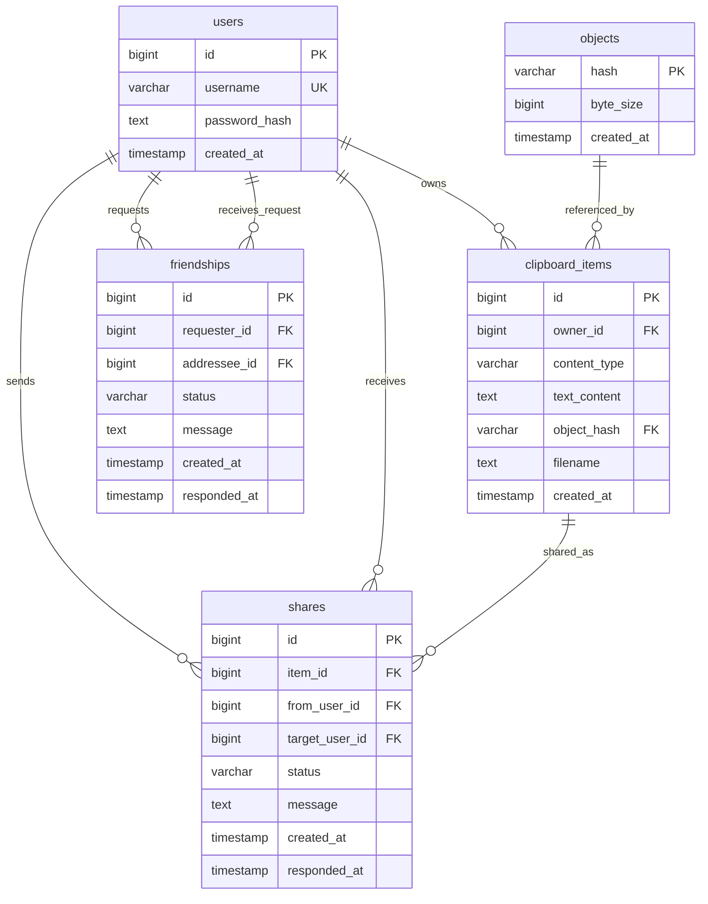

# Backend Design

## 目标

后端负责用户账户、云端剪切板、历史记录、分享关系和多设备同步通知。HTTP API 承载数据读写，SSE 只推送“状态已变化”的轻量通知。

## 总体架构

```text
Client
  -> HTTP API
  -> Auth / Application Services
  -> PostgreSQL + Local Object Store

Client
  -> SSE Realtime Channel
  -> Notification Gateway
```

核心原则：

- 小文本直接入库。
- 图片、文件、二进制写入本地对象存储，数据库只保存 SHA-256 hash 和大小。
- 当前剪切板不单独建表，等于用户最新一条 `clipboard_items`。
- 历史记录不单独建表，`clipboard_items` 本身就是历史表。
- 好友关系用独立 `friendships` 表记录请求、接受和拒绝状态。
- 分享功能用独立 `shares` 表记录关系和状态，且只能分享给已接受好友。
- JWT 为自包含会话；数据库只保存用户账号，不保存设备和 refresh token。

## 模块划分

```text
api/
  auth
  users
  clipboard
  friends
  shares
  realtime

application/
  auth_service
  clipboard_service
  friend_service
  share_service
  user_service

domain/
  user context

infrastructure/
  database
  object_store
  jwt
  password_hash
```

## 鉴权

请求头：

```http
Authorization: Bearer <access_token>
```

JWT payload 包含：

```json
{
  "sub": 1,
  "device_id": "user-1:desktop",
  "exp": 1770000000,
  "iat": 1770000000,
  "jti": "token_id"
}
```

## 数据库模型

### users

```text
id PK
username UNIQUE
password_hash
created_at
```

### objects

```text
hash PK
byte_size
created_at
```

对象文件不保存数据库路径，路径由 `hash` 计算：

```text
objects/ab/cd/ef...
```

### clipboard_items

```text
id PK
owner_id FK -> users.id
content_type
text_content
object_hash FK -> objects.hash
filename
created_at
```

约束：

- `text`、`file_list` 必须有 `text_content`，不能有 `object_hash`。
- `image`、`file`、`binary` 必须有 `object_hash`，不能有 `text_content`。
- `current clipboard = owner_id 最新 clipboard_items`。
- `history = owner_id 所有 clipboard_items`。

### friendships

```text
id PK
requester_id FK -> users.id
addressee_id FK -> users.id
status
message
created_at
responded_at
```

约束：

- `requester_id <> addressee_id`。
- 同一对用户在 `pending` / `accepted` 状态下只能存在一条有效关系。
- 分享创建前必须存在双向等价的 `accepted` 好友关系。

### shares

```text
id PK
item_id + from_user_id FK -> clipboard_items(id, owner_id)
from_user_id FK -> users.id
target_user_id FK -> users.id
status
message
created_at
responded_at
```

分享只保存关系和状态。接受分享时，服务端把原 `clipboard_items` 复制成目标用户的新历史记录；对象内容仍然复用同一个 `objects.hash`。

## E-R 图



## API

认证：

```text
POST /api/v1/auth/register
POST /api/v1/auth/login
POST /api/v1/auth/refresh
POST /api/v1/auth/logout
GET  /api/v1/me
```

剪切板：

```text
GET    /api/v1/clipboard/current
POST   /api/v1/clipboard/current
POST   /api/v1/clipboard/current/upload
GET    /api/v1/clipboard/history?limit=20&cursor=...
GET    /api/v1/clipboard/history?all=true
DELETE /api/v1/clipboard/history/{item_id}
GET    /api/v1/clipboard/items/{item_id}
GET    /api/v1/clipboard/items/{item_id}/content
GET    /api/v1/clipboard/items/{item_id}/thumbnail
```

分享：

```text
GET  /api/v1/users/search?q=alice
GET  /api/v1/friends
POST /api/v1/friends
GET  /api/v1/friends/incoming
GET  /api/v1/friends/outgoing
POST /api/v1/friends/{friendship_id}/accept
POST /api/v1/friends/{friendship_id}/reject
POST /api/v1/shares
GET  /api/v1/shares/incoming
GET  /api/v1/shares/outgoing
POST /api/v1/shares/{share_id}/accept
POST /api/v1/shares/{share_id}/reject
```

## 实时通知

服务端使用 SSE 推送轻量事件。客户端收到事件后再调用 HTTP API 拉取当前剪切板或历史：

```text
GET /api/v1/clipboard/current
GET /api/v1/clipboard/history?all=true
```
